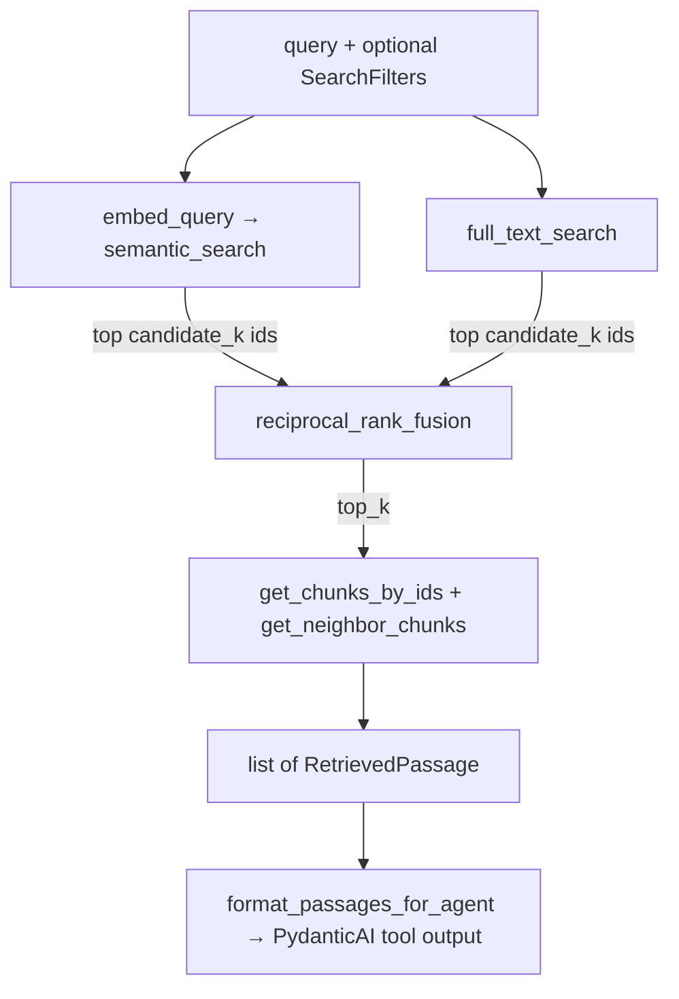

# Retrieval

Hybrid search over CVM DFP chunks in Supabase Postgres. Each query runs a **semantic** (pgvector) and a **keyword** (Postgres full-text, `portuguese` config) search in parallel, fuses the two ranked id lists with **Reciprocal Rank Fusion**, then hydrates the winners with filing metadata and neighboring chunks.



## How each path ranks

- **Semantic** orders by cosine distance (`embedding <=> query_vec`) on the HNSW index. It turns on pgvector's iterative index scan (`hnsw.iterative_scan = strict_order`) and sets `ef_search` to the candidate limit. Without that, HNSW returns at most 40 candidates and applies the ticker/year filter *afterwards*, so a filtered query could come back empty.
- **Full-text** lets Postgres remove stopwords and stem the question (`to_tsvector('portuguese', q)`), then ORs the lexemes into a `tsquery` and ranks with `ts_rank_cd`. `plainto_tsquery` would AND every word, so a full question would match almost nothing. With OR plus ranking, the behavior is close to BM25 and needs no LLM keyword-extraction step.
- **RRF** fuses ranks, not scores (cosine and `ts_rank_cd` are on incomparable scales): `score = Σ 1 / (k + rank)`.

## Settings (`app/config.py`, overridable via env)

| Setting | Default | Role |
| --- | --- | --- |
| `retrieval_candidate_k` | `50` | Hits fetched from **each** path before fusion |
| `retrieval_top_k` | `10` | Fused passages returned |
| `retrieval_rrf_k` | `60` | RRF constant |
| `retrieval_neighbor_radius` | `1` | Chunks before/after each hit attached as context |

## Filters

`SearchFilters(ticker, fiscal_years)` narrows both paths (`sd.ticker = :ticker`, `sd.fiscal_year = ANY(:fiscal_years)`). Unset fields apply no filter.

## Module map

| File | Responsibility |
| --- | --- |
| `retriever.py` | `DocumentRetriever`: search, `read_chunks`, `read_surrounding` |
| `queries.py` | pgvector + full-text SQL and filter clauses |
| `fusion.py` | Reciprocal Rank Fusion |
| `embeddings.py` | OpenAI embeddings (shared with ingestion) |
| `types.py` | `SearchFilters`, `RetrievedPassage`, bounded agent formatting |
| `../database/documents.py` | Chunk hydration and neighbor lookups |
| `../assistant/tools.py` | PydanticAI tools wrapping the retriever |

## Smoke test

```bash
uv run python -m scripts.smoke_retrieval
```

## Known limitation

The `portuguese` config doesn't strip accents, so "liquida" won't match "líquida" in full-text search (semantic search still covers it). Fixing this needs `unaccent` in a migration that regenerates `search_vector`.
